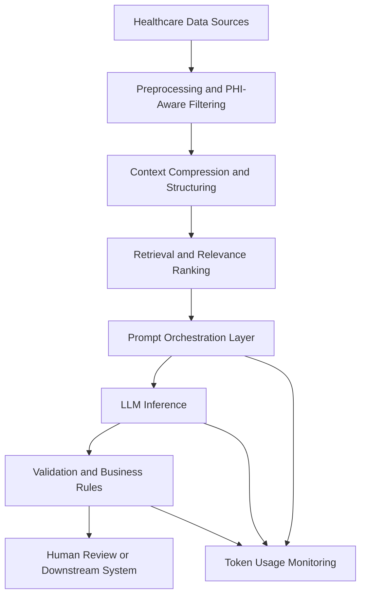

# ITHealthCare_TokenOps


Token optimization and AI efficiency patterns for the IT healthcare domain.

## Table of Contents

- [Overview](#overview)
- [Business Value](#business-value)
- [Technical Architecture](#technical-architecture)
- [Architecture Diagram](#architecture-diagram)
- [Core Technical Strategies](#core-technical-strategies)
- [Implementation Examples](#implementation-examples)
- [Example Healthcare Pipelines](#example-healthcare-pipelines)
- [Sample Token Cost Calculations](#sample-token-cost-calculations)
- [Metrics and KPIs](#metrics-and-kpis)
- [Example ROI Questions](#example-roi-questions)
- [HIPAA and Compliance Considerations](#hipaa-and-compliance-considerations)
- [Implementation Guidance](#implementation-guidance)
- [Future Enhancements](#future-enhancements)
- [Conclusion](#conclusion)

## Overview

This repository is focused on reducing token consumption, lowering inference cost, improving latency, and increasing throughput for healthcare AI workflows. In healthcare IT environments, large language models are often applied to clinical documentation, prior authorization, claims processing, policy interpretation, patient communication, and operational support. These workflows can become expensive and slow if prompts, context, retrieval, and outputs are not engineered efficiently.

This README outlines the technical, business, and compliance dimensions of token optimization for healthcare systems.

## Business Value

Token optimization creates measurable operational value for healthcare organizations:

- **Lower AI operating cost** by reducing unnecessary prompt and response tokens
- **Faster workflow execution** for clinicians, coders, support staff, and administrators
- **Higher throughput** for large-scale document and communication pipelines
- **Better scalability** across departments such as revenue cycle, patient services, utilization management, and compliance
- **Improved consistency** through prompt standardization and structured outputs
- **Stronger governance alignment** by reducing unnecessary exposure of sensitive data

### Expected Business Outcomes

- Reduced cost per transaction for AI-assisted workflows
- Improved response time in staff-facing and patient-facing systems
- Better productivity in documentation and review-heavy tasks
- Easier monitoring of AI value realization by department and workflow
- More sustainable deployment of healthcare AI solutions at enterprise scale

## Technical Architecture

A token-efficient healthcare AI workflow typically includes the following layers:

1. **Input Acquisition Layer**
   - EHR extracts
   - clinical notes
   - payer documents
   - policy manuals
   - service desk tickets
   - patient communication streams

2. **Preprocessing Layer**
   - de-duplication of repeated note content
   - PHI-aware filtering and minimum-necessary selection
   - normalization of dates, codes, and provider references
   - conversion of free text into structured intermediate forms

3. **Retrieval and Context Selection Layer**
   - chunking of source documents
   - relevance scoring
   - top-k document selection
   - citation and evidence selection
   - removal of low-value historical context

4. **Prompt Orchestration Layer**
   - compact role instructions
   - task-specific templates
   - multi-step prompting
   - schema-constrained outputs
   - fallback paths for missing information

5. **Postprocessing and Validation Layer**
   - rule-based verification
   - structured output parsing
   - confidence checks
   - exception routing for human review
   - audit logging

6. **Observability Layer**
   - token usage tracking
   - prompt version analytics
   - latency metrics
   - output quality scoring
   - workflow-specific KPI dashboards

## Architecture Diagram



## Core Technical Strategies

### 1. Prompt Compression

Use highly specific and compact prompts rather than broad instructions. Reusable healthcare prompt templates should minimize repeated explanatory text while preserving clinical or operational intent.

**Examples:**
- Replace long instruction blocks with parameterized templates
- Use role-specific templates for coders, reviewers, and care coordinators
- Move static guidance into system prompts and keep user prompts task-specific

### 2. Context Window Management

Large context windows should not be treated as a default. Only include the minimum necessary data required to complete the task safely.

**Practices:**
- Include only relevant portions of the patient or workflow record
- Exclude duplicated note sections and boilerplate language
- Summarize longitudinal history before downstream decision tasks
- Separate current encounter context from historical reference data

### 3. Structured Data First Design

Whenever possible, use structured inputs such as diagnosis codes, procedure codes, eligibility attributes, timestamps, and metadata before passing raw text.

**Benefits:**
- fewer tokens
- improved consistency
- easier validation
- better downstream automation

### 4. Retrieval Optimization

Retrieval-augmented generation must be tuned for healthcare documentation, where records are large and repetitive.

**Recommended controls:**
- optimize chunk size for clinical and payer document types
- tune top-k retrieval to avoid context overload
- use semantic ranking plus business filtering
- attach only the evidence required for final output generation
- maintain source attribution for policy and compliance use cases

### 5. Multi-Step Pipeline Design

Break long tasks into smaller token-efficient stages.

**Example pattern:**
1. classify request
2. extract relevant facts
3. retrieve supporting references
4. summarize decision context
5. generate structured output
6. validate against business rules

This usually outperforms a single large prompt in both cost and reliability.

### 6. Output Constraint Engineering

Outputs should be narrow, structured, and easy to validate.

**Preferred output forms:**
- JSON schema
- bullet summaries
- fixed-column tables
- short decision statements
- code/value mappings

This reduces verbosity and improves system integration.

### 7. Caching and Reuse

Frequently reused artifacts should be cached when operationally appropriate.

**Examples:**
- policy summaries
- standard operating procedures
- payer rule interpretations
- reference glossaries
- repeated prompt fragments

## Implementation Examples

### Example 1: Token-Aware Prompt Builder

```python
from typing import Dict, List


def build_clinical_summary_prompt(patient_context: Dict, note_sections: List[str]) -> str:
    relevant_sections = [section.strip() for section in note_sections if section and len(section.strip()) > 30]
    compressed_context = "\n".join(relevant_sections[:5])

    prompt = f"""
You are a healthcare documentation assistant.
Summarize only clinically relevant updates.
Return output in JSON with keys: chief_complaint, assessment, plan, risks.

Patient Context:
{patient_context}

Relevant Notes:
{compressed_context}
""".strip()

    return prompt
```

### Example 2: Structured Output Schema

```json
{
  "chief_complaint": "string",
  "assessment": "string",
  "plan": ["string"],
  "risks": ["string"],
  "missing_information": ["string"]
}
```

### Example 3: Prior Authorization Decision Flow

```python

def prior_auth_pipeline(request_type, clinical_summary, payer_rules):
    return {
        "request_type": request_type,
        "required_evidence": extract_required_evidence(clinical_summary, payer_rules),
        "decision_support": "approved_if_all_criteria_met",
        "manual_review": False
    }
```

## Example Healthcare Pipelines

### A. Clinical Note Summarization

**Goal:** produce concise encounter summaries with minimal token overhead.

**Efficient pattern:**
- remove duplicate text from imported note sections
- extract medications, diagnoses, procedures, and assessment text
- summarize only clinically relevant changes
- return structured summary sections instead of narrative prose

### B. Prior Authorization Review

**Goal:** evaluate submitted documentation against payer requirements efficiently.

**Efficient pattern:**
- classify request type
- retrieve only relevant payer guideline sections
- extract required evidence from clinical documents
- produce a structured checklist with pass/fail and rationale

### C. Revenue Cycle and Coding Support

**Goal:** assist coding teams without sending entire charts to the model.

**Efficient pattern:**
- preprocess encounter metadata and coded fields
- identify documentation gaps
- generate brief coding suggestions with supporting evidence
- route uncertain outputs for manual review

### D. Healthcare Helpdesk Automation

**Goal:** reduce support burden for common staff and operational requests.

**Efficient pattern:**
- categorize ticket
- retrieve relevant SOP or policy article
- answer in short templated format
- escalate only exceptions or ambiguous cases

## Sample Token Cost Calculations

The following examples illustrate how token optimization can reduce operating cost.

### Example 1: Before and After Prompt Compression

| Scenario | Input Tokens | Output Tokens | Total Tokens | Relative Cost |
|---|---:|---:|---:|---:|
| Baseline verbose workflow | 4,000 | 800 | 4,800 | 100% |
| Optimized workflow | 1,800 | 400 | 2,200 | 45.8% |
| Savings | 2,200 | 400 | 2,600 | 54.2% |

### Example 2: Monthly Volume Estimate

Assume:
- 25,000 healthcare workflow requests per month
- average reduction of 2,000 tokens per request

Estimated monthly token savings:

```text
25,000 x 2,000 = 50,000,000 tokens saved per month
```

### Example 3: Cost Impact Template

```text
monthly_cost = requests_per_month x average_tokens_per_request x model_cost_per_token
optimized_monthly_cost = requests_per_month x optimized_tokens_per_request x model_cost_per_token
monthly_savings = monthly_cost - optimized_monthly_cost
```

### Example 4: Latency Impact Estimate

If a workflow reduces retrieval and prompt size by 40% to 60%, teams may also observe:
- lower average response latency
- faster throughput for document-heavy workflows
- reduced queue time for concurrent requests

## Metrics and KPIs

A mature token optimization program should track both technical and business measures.

### Technical Metrics

- average input tokens per request
- average output tokens per request
- retrieval token contribution
- prompt template version performance
- end-to-end latency
- validation failure rate
- human review escalation rate

### Business Metrics

- cost per workflow transaction
- total monthly AI spend by department
- throughput improvement by use case
- turnaround time for review-heavy processes
- staff productivity gains
- rework reduction
- time-to-resolution for support requests

## Example ROI Questions

Healthcare leaders may evaluate:
- How much token cost was reduced per prior authorization case?
- How much faster can coding support tasks be completed?
- What percentage of helpdesk requests can be resolved with low-token workflows?
- Which prompt version yields the best balance of quality, latency, and spend?

## HIPAA and Compliance Considerations

Healthcare token optimization should align with security, privacy, and regulatory controls.

### HIPAA-Aware Practices

- apply the **minimum necessary** standard when selecting prompt context
- reduce unnecessary PHI included in requests to models
- de-identify or mask data when full identifiers are not required
- maintain access controls for prompt logs, outputs, and evaluation data
- document model usage boundaries for administrative and clinical workflows
- establish retention and audit policies for AI-generated content

### Governance Controls

- log prompt templates and output schema versions for traceability
- define approval paths for high-risk workflow changes
- implement human review for sensitive clinical or financial decisions
- validate model outputs against payer rules, coding standards, and internal policy
- monitor drift in prompt effectiveness and output quality over time

### Compliance Review Questions

- Does this workflow expose more PHI than required?
- Can the task be completed with structured metadata instead of raw text?
- Is human review required before downstream action?
- Are prompts and outputs auditable for compliance and quality review?
- Are security controls applied consistently across environments?

## Implementation Guidance

Teams implementing this repository concept should consider the following sequence:

1. identify high-volume healthcare workflows
2. baseline token usage and latency
3. isolate repeated context and boilerplate
4. redesign prompts into structured templates
5. introduce retrieval and summarization controls
6. add monitoring and KPI dashboards
7. continuously test quality versus token cost tradeoffs

## Future Enhancements

Potential additions to this repository may include:
- benchmark datasets for healthcare prompt optimization
- reusable prompt template library
- token usage analytics dashboards
- evaluation scripts for latency, cost, and quality
- reference architectures for payer, provider, and support workflows

## Conclusion

Token optimization in healthcare IT is both an engineering discipline and a business strategy. By controlling prompt size, retrieval scope, output structure, and observability, organizations can build AI systems that are more affordable, faster, safer, and easier to scale across clinical and administrative operations.
